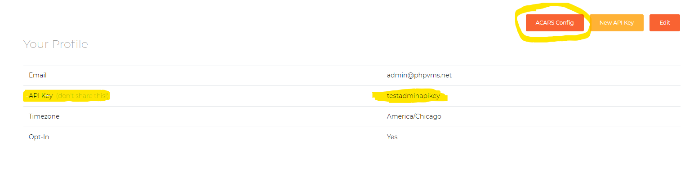
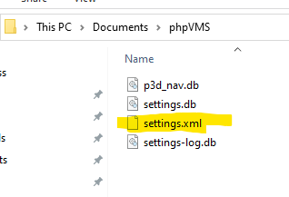
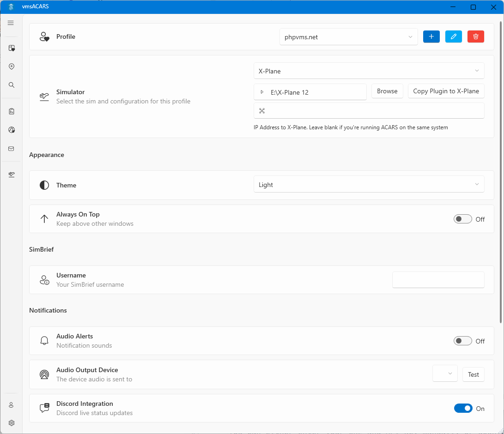

## Get the URL and API Key

You can either enter your URL and API key manually or download the settings
config file from your phpVMS profile. To download the config file, visit your VA
and go to your profile:

And place it a folder called `Documents\vmsacars\profiles`:

## Client Settings

After downloading the latest ACARS version, on startup, you'll be brought to the
configuration/settings page:

## Sim Selection

After entering your URL and API key, select the simulator, and then select the
path to the simulator's root folder (for Fs9/FsX/Prepar3d or X-Plane)

:::info

FSX/Prepar3d requires the `MakeRwys.exe` file, which can be downloaded from the
[FSUIPC Page](http://fsuipc.simflight.com/beta/MakeRwys.zip). It needs to be
placed in the same directory as FSX/Prepar3d, and it will create the required
files needed to scan.

:::

---

## Mac/Linux Configuration

To run ACARS with X-Plane on the Mac or Linux, you have to run Windows in a VM.
On the Mac, I use [VMWare Fusion](https://www.vmware.com/products/fusion.html),
which is free for personal use. The procedure below will be similar for
Parallels or Virtual Box, which is roughly:

1. Add the X-Plane folder as a shared folder/mount to the Windows VM
1. Copy the `AcarsConnect` plugin to the `Resources\plugin` folder (see
   [Install](install.md))
1. Set the IP address in ACARS to the IP of the host

Then click "Open In Guest", and you can follow the above instructions for then
installing the plugin. Then, in ACARS, properly set the IP to your Mac machine.

Then you can launch/run ACARS as usual.
