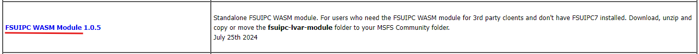
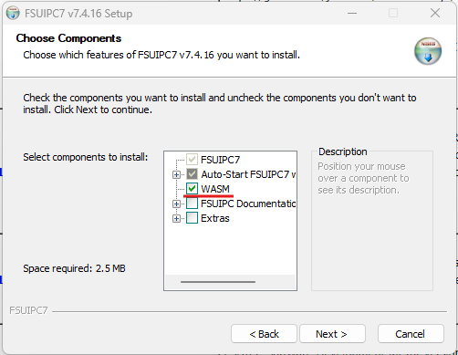
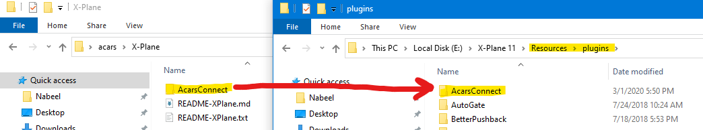
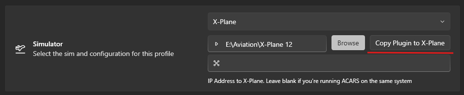

```mdx-code-block
import Tabs from '@theme/Tabs';
import TabItem from '@theme/TabItem';
```

## ACARS Client

After downloading the installer, extract it and run it. It will install into:

```
%LocalAppData%\vmsacars\current
```

Desktop and start menu shortcuts will be created, and the program will be
registered.

## Simulator Configuration

<Tabs>
  <TabItem value="msfs" label="MSFS 2020/2024" default>
    #### WASM Module

    If you're using Microsoft Flight Simulator, to read the LVars from the sim you
    need the `FSUIPC WASM Module (Version)` from [FSUIPC](https://www.fsuipc.com/) ,
    `fsuipc-lvar-module` folder needs to be manually placed in your community
    folder.

    

    Also, it is possible to install the WASM Module with FSUIPC main installer.
    While installing or updating it, be sure you have the WASM Module option
    enabled.

    

    ##### Permission Denied Errors

    If you're getting a permission-denied error, see
    [this thread](https://forum.navigraph.com/t/faq-navigraph-navdata-center-could-not-find-access-simulator/2104)

  </TabItem>
  <TabItem value="xplane" label="X-Plane">

    X-Plane uses a custom plugin. Open the `X-Plane` folder, and copy the
    `AcarsConnect` folder into your `Resources\plugins` folder.

    

    Also it is possible to copy the plugin automatically from vmsAcars settings, be
    sure X-Plane is not running and click the `Copy Plugin To X-Plane` button after
    selecting your X-Plane root/main folder.

    

  </TabItem>
  <TabItem value="banana" label="Prepar3d/FSX">
    To use FSX/Prepar3d, you need to install:

    - [FSUIPC](http://www.fsuipc.com) - the licensed version isn't required.
    - [MakeRwys](http://fsuipc.simflight.com/beta/MakeRwys.zip)

    After installing both, run `MakeRwys`. `MakeRwys` also needs to be re-run
    whenever there are scenery changes (if you want gates/runways to be updated).
    ACARS will automatically detected changes to the MakeRwys files, and will
    update its internal database accordingly.

    #### Hardware Configuration

    If you're using hardware to control the sim, ACARS heavily relies on several
    offsets with FSUIPC, particularly the parking brake. Ensure that the offset
    `0x0BC8` gets set

  </TabItem>
</Tabs>
