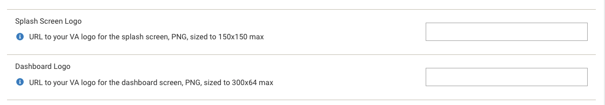
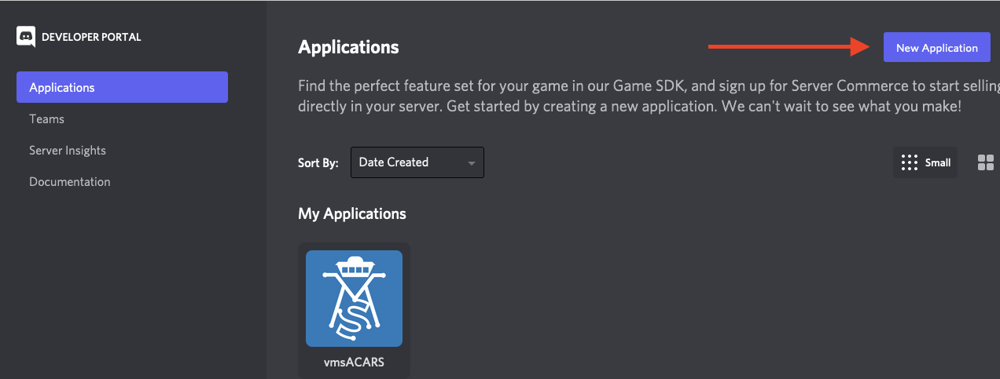
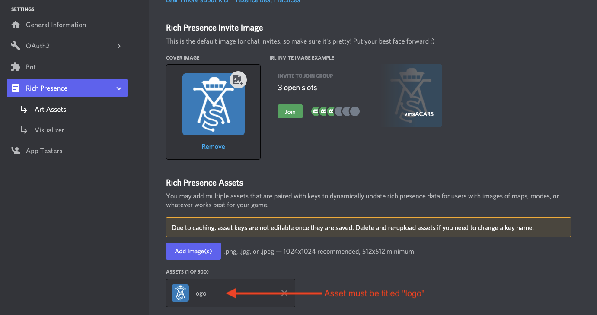
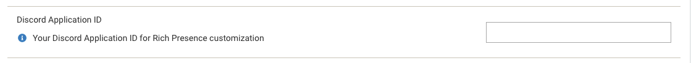

## Logo Images

You can add your logo to the splash screen and the dashboard. They will be resized down to fit. Fill in the URLs to your logos. They should be PNG format (transparency is supported):

---

## Discord Rich Presence

To customize the "Rich Presence" dialog in Discord, you need to create a new Application in Discord. You'll then enter the provided `Application ID` into the admin panel. If you don't set this, the default "vmsACARS" application will be used.

### 1. Create the Application

Visit [Discord Application Developer site](https://discord.com/developers/applications), and select "New Application". I suggest using your VA name, it will say something like "Playing <whatever you enter>" (or something like "VA Name ACARS")

Upload your logo and title it appropriately. **Make note of the "Application ID" here, this will go into the admin panel.** 

### 2. Add your logos to the art assets

Next, go to "Rich Presence" and then "Art Assets". Add your cover image here, and add a new **Rich Presence Asset** titled `logo`. This will be used in the mini box that shows up

:::info

The logo asset added must be titled `logo`

:::

### 3. Set the application ID

Set the application ID in the admin panel.

