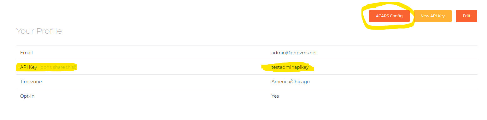
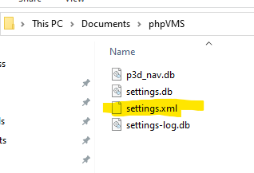
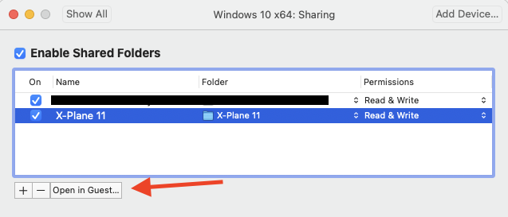

# Installation (Client)

---
## ACARS Client

After downloading the zip, just extract the client into a folder (e.g, on your desktop into a folder called `ACARS`). Then you can create a desktop shortcut from the `acars.exe` for easier access.

---

## Simulator Configuration

### FSX/Prepar3d Configuration

To use FSX/Prepar3d, you need to install:

- [FSUIPC](http://www.fsuipc.com) - the licensed version isn't required.
- [MakeRwys](http://fsuipc.simflight.com/beta/MakeRwys.zip)

After installing both, run `MakeRwys`. `MakeRwys` also needs to be re-run whenever there are scenery changes (if you want gates/runways to be updated).

### X-Plane Configuration

X-Plane uses a custom plugin. Open the `X-Plane` folder, and copy the `AcarsConnect` folder into  your `Resources\plugins` folder.

### MSFS Configuration

:::caution
Due to an MSFS limitation, sceneries purchased through the MSFS store can't be read because they're encrypted. Only sceneries purchased outside of the store and manually placed in the `Community` directory can be read
:::

To use MSFS, select "Microsoft Flight Simulator" from the simulator list and click 'Rescan Scenery'. 

#### Permission Denied Errors

If you're getting a permission denied error, see [this thread](https://forum.navigraph.com/t/faq-navigraph-navdata-center-could-not-find-access-simulator/2104)

---

## Client Config

### Get the URL and API Key

You can either enter your URL and API key manually, or download the settings config file from your phpVMS profile. To download the config file, visit your VA and go to your profile:

And place it a folder called `My Documents/phpVMS`:

### Client Settings

After downloading the latest ACARS version, on startup, you'll be brought to the configuration/settings page:

### Sim Selection

After entering your URL and API key, select the simulator, and then select the path to the simulator (for Prepar3d or X-Plane)

:::info
FSX/Prepar3d requires the `MakeRwys.exe` file, which can be downloaded from the [FSUIPC Page](http://fsuipc.simflight.com/beta/MakeRwys.zip). It needs to be placed in the same directory as FSX/Prepar3d, and it will create the required files needed to scan.
:::

After selecting the directory, click `Re-Scan Scenery`. This will load the scenery database into ACARS for it to run/load later

---

## Mac/Linux Configuration

To run ACARS with X-Plane on the Mac or Linux, you have to run Windows in a VM. On the Mac, I use [VMWare Fusion](https://www.vmware.com/products/fusion.html), which is free for personal use. The procedure below will be similar for Parallels or Virtual Box, which is roughly:

1. Add the X-Plane folder as a shared folder/mount to the Windows VM
1. Copy the `AcarsConnect` plugin to the `Resources\plugin` folder (see above)
1. Set the IP address in ACARS to the IP of the host

In order to get the scenery scanning working properly, add X-Plane as a shared folder:

Then click "Open In Guest", and you can follow the above instructions for then installing the plugin. Then, in ACARS, properly set the "Scenery Path" and IP to your Mac machine:

:::info
If you configure it to point to the X-Plane root, the default share path for VMWare Fusion would be `\\vmware-host\Shared Folders\X-Plane 11`.
:::

Then you can launch/run ACARS as usual.

---

## Hardware Configuration

If you're using hardware to control the sim, ACARS heavily relies on several offsets with FSUIPC, particularly the parking brake. Ensure that the offset `0x0BC8` gets set
