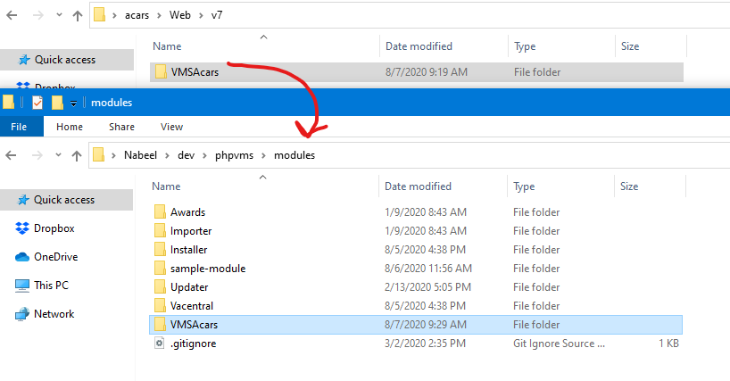
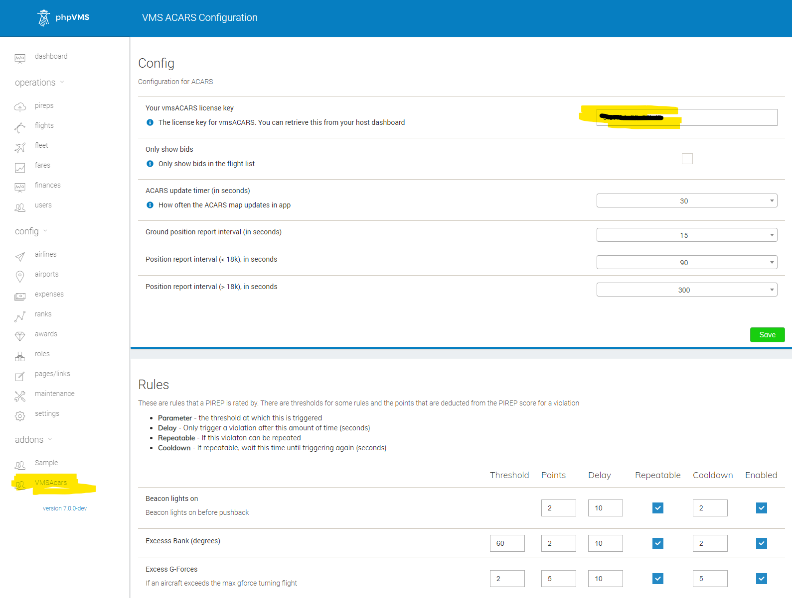

## 1. Module Installation

For the server-side installation, open the `Web/v7` folder and copy the `VMSAcars` into your `phpvms/modules` folder:

Then go to your site's URL to the `/update` folder, and follow through the update. When there are updates (as notified in the ACARS Changelog), you will do the same thing - copy the module folder in and then run the `/update` again.

## 2. License Entry

After installation, go to the admin panel, and enter your license key, from your https://vmshost.io invoice/email:

