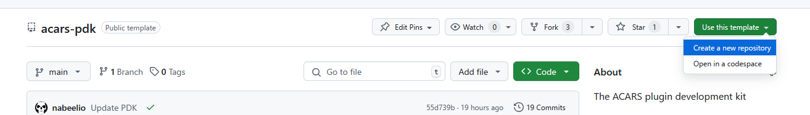

# Setting Up Your Environment

You are required to have Node.js installed on your machine. You can download it
from [here](https://nodejs.org/en/download/).

Create a new plugin repository by cloning the
[acars-pdk](https://github.com/phpvms/acars-pdk) repository by clicking "Use
this template", and then "Creat a new repository"



Clone your new repository to your local machine

1. Copy the `.env.example` to `.env`
2. Edit the file to set your `ACARS_PROFILE_NAME`
3. Run `npm install`

```dotenv
# This is the profile name to use when exporting
ACARS_PROFILE_NAME=phpvms.net

# This is the path to the configuration root
ACARS_CONFIG_PATH=$HOME/Documents/vmsacars

# This is the path to where the scripts, etc are stored
# It's used in the live-watch
ACARS_SCRIPTS_PATH=$HOME/Documents/vmsacars/data/$ACARS_PROFILE_NAME/config

# Name of the distribution zip file that's created
ACARS_DIST_ZIP=dist.zip
```

---

# Creating a rule

Create a rule file under `src/rules/example.ts`, and you can use the following:

```typescript
/**
 * This is an example rule that you can use as a template
 */
import {Meta, Rule, RuleValue} from '../types/rule';
import {Pirep, Telemetry} from '../types/types';
import {PirepState} from '../defs.js';

/**
 * This is the rule class that will be used to check the rule
 * The name doesn't really matter, but it should be unique
 */
export default class ExampleRule implements Rule {
  /*
   * You can look at the definition of Meta for the fields
   * But you can also add additional fields for your rule
   * if you want
   */
  meta: Meta = {
    id: 'ExampleRule',
    name: 'An Example Rule',
    enabled: true,
    message: 'A example rule!',
    states: [],
    repeatable: false,
    cooldown: 60,
    max_count: 3,
    points: -1,
    delay_time: 5000,
  };

  violated(pirep: Pirep, data: Telemetry, previousData?: Telemetry): RuleValue {
    /*
     * This will check that this rule has been violated
     * for this number of milliseconds specified in the
     * delay_time
     */
    return Acars.ViolatedAfterDelay(
      this.meta.name,
      this.meta.delay_time,
      (): RuleValue => {
        return ['The example was violated!', this.meta.points];
      },
    );
  }
}
```

# Compile and Build

Run the following to compile the Typescript and build the distribution:

```bash
npm run dev
```

This will also watch the `src/` directory for changes and recompile and copy
them. Next, launch ACARS, and start a flight. In the logs, you should see a log
that looks like:

> Adding module file:///path/to/data/phpvms.net/config/aircraft/example.js

Now the above rule won't do anything, because we haven't added any active
states. Make sure that you're still running the above `npm run local` command,
and let's change the rule to add states it's valid in:

```typescript
meta: Meta = {
  // ...
  states: [PirepState.Boarding],
  // ...
};
```

You should see the rule being copied to the directory, and then ACARS reloading
the rules:

> Detected change in space=rules; file=example.js; type="Changed"

And then you should see some logs about the rule being run:

> Starting timer for An Example Rule_violated_after\
> Rule: An Example Rule - Timer delay of 5993.9036 passed, marking violated\
> Rule: An Example Rule, rule: The example was violated!, -1 points\
> Violation: An Example Rule (1x) - The example was violated!;

# Distribute

Now that you have your rule, you can distribute it to other users. Run the
following to create a distribution zip file:

```bash
npm run export
```

This will create a zip file in the `dist/` directory, by default it's named
`dist.zip`. You can rename this in the `.env` file. Upload this file somewhere,
and then, in the ACARS web module, set the URL. It will then get downloaded by
ACARS and loaded in.
