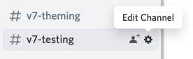
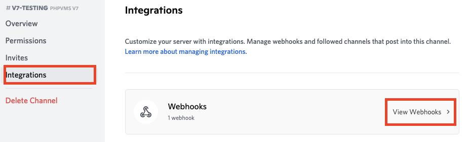
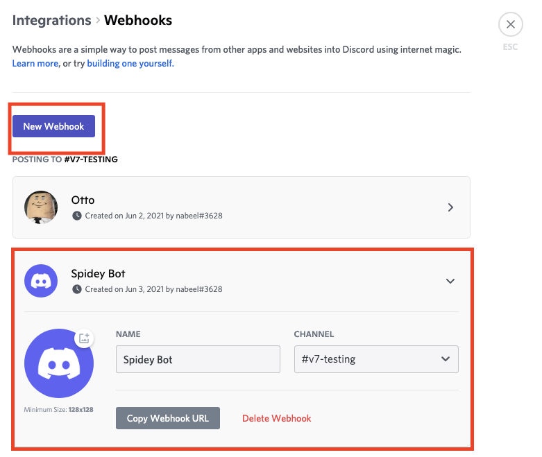
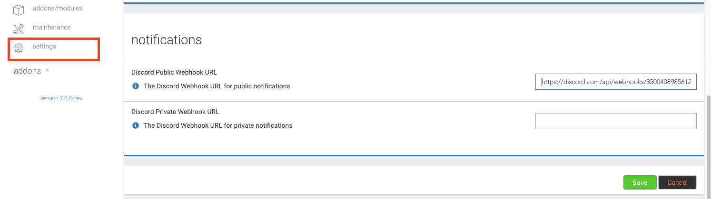

phpvms sends event notifications to Discord via webhooks. Two webhooks are
supported:

- **Public webhook** — for events visible to your community
- **Private webhook** — for restricted events (separate channel, typically
  admin-only)

### Public events

- PIREP prefile
- PIREP state changes (boarding, taxi, landed, etc)
- PIREP filed
- News added

### Private events

- User registrations

## Discord setup

Webhooks are how Discord receives notifications from external services. Full
Discord docs:
[Intro to Webhooks](https://support.discord.com/hc/en-us/articles/228383668-Intro-to-Webhooks).

### 1. Create the webhook

Edit the channel you want notifications in (you can move the webhook later).

Open **Integrations**, then **View Webhooks**.

Click **Add Webhook** and fill in the details.

Copy the webhook URL — you'll paste it into the admin panel next.

Repeat if you want a separate private webhook for user registrations.

### 2. Add to phpvms

In the admin panel, paste the webhook URL into the corresponding setting:

That's it — events fire to Discord from now on.
