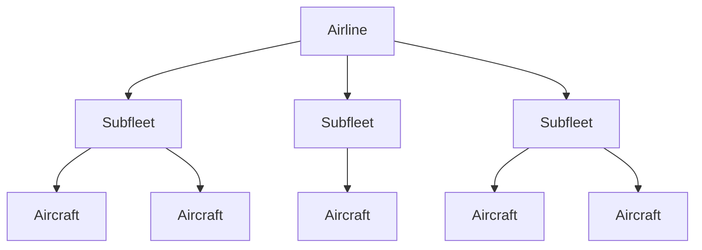
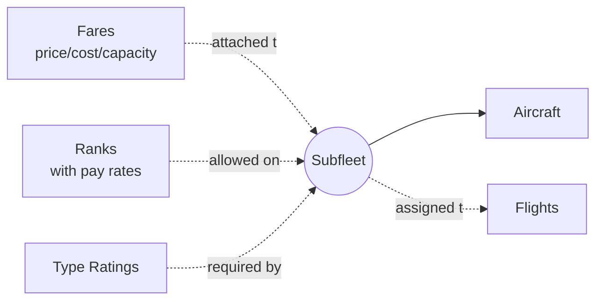
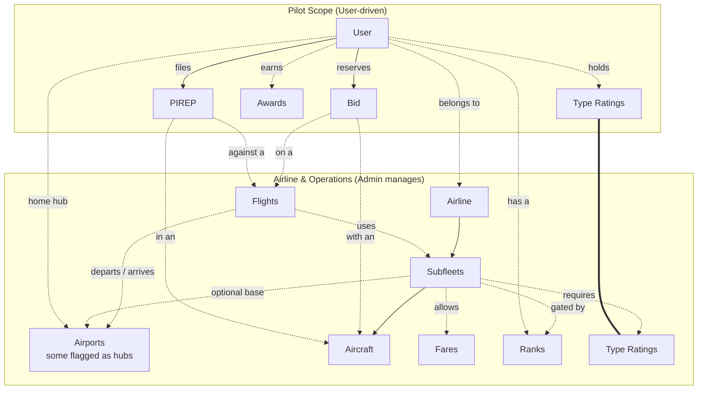
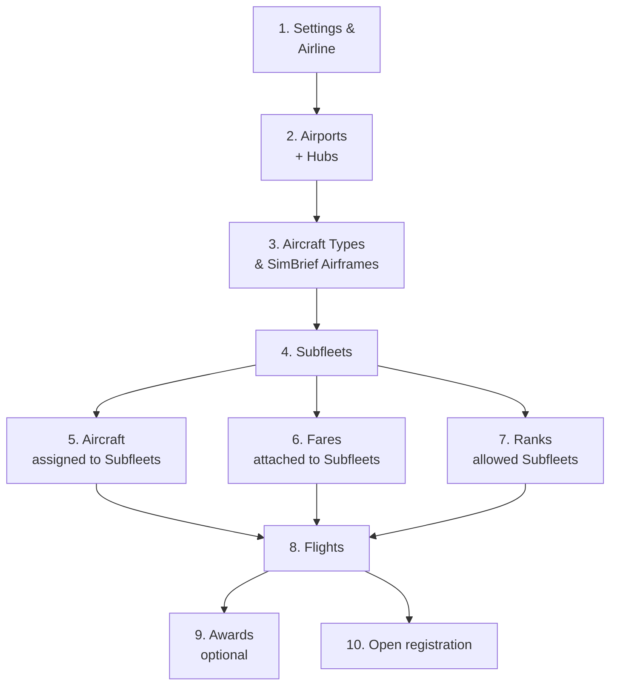

# How phpvms Works

phpvms is built around a set of entities that work together to model how a real
airline operates. This page explains how those pieces fit together — and the
order to set them up — before you dive into the admin panel.

## Airlines

An airline owns multiple subfleets; each subfleet contains aircraft. Aircraft
never live outside a subfleet.

## Subfleets

A subfleet is a key unit: it bundles **fares** (with overridable
price/cost/capacity), gates access by **rank**, optionally requires **type
ratings**, and is what **flights** reference when scheduling.

## The Pilot's Loop

Two scopes: what an **admin** configures, and what a **pilot** drives. Dashed
arrows cross between them — that's where pilot activity references
admin-configured entities.

The `===` link shows pilot type-ratings and subfleet-required type- ratings are
the same entity, just rendered in both scopes for clarity.

The whole airline economy hangs off accepted PIREPs: a pilot bids on a flight +
aircraft, files a PIREP, an admin accepts it, and the system posts journal
entries (revenue, fuel, pay), credits hours, re-checks awards, and may
auto-promote rank. Until a PIREP is accepted, no money moves and no hours are
credited.

## Configuration Order

After installation, configure your airline in this order. Each step depends on
the previous one.

**Why this order:** Subfleets are a branching unit — Aircraft live inside them,
Fares attach to them, Ranks gate them, and Flights reference them. Get airlines,
airports, and the aircraft types you need first, then build subfleets, then
everything else slots in.

## Core entities

### Airline

Container for everything: flights, aircraft (via subfleets), and pilots. You
need at least one. Pilots pick an airline at registration, and most resources
scope to it.

Key fields: ICAO code (3 letters, e.g. `BAW`), IATA code (2 letters, e.g. `BA`),
name, callsign.

You can run multi-airline VAs — pilots register under one, and admins can
transfer them later.

### Airport

Every airport in your network. Mark airports as **hubs** to make them selectable
as a pilot's home base.

- ICAO is the primary key (e.g. `EGLL`).
- `hub` is a boolean flag — non-hub airports are still usable as flight
  departure/arrival points; the flag only controls whether pilots can pick them
  at registration.
- Subfleets can optionally be based at a specific hub airport.

### Subfleet

The most important abstraction in phpvms. A subfleet is a **named group of
aircraft** that share fares, ranks, and (optionally) a base hub.

Think of it as how a real airline groups its fleet operationally — British
Airways' "767-336ER RR RB211 short-haul Y-class" is a subfleet, and so is
"777-200ER GE90 long-haul J/Y".

A subfleet defines:

- **Type** (an arbitrary code, e.g. `B763-LH-FJY`)
- **Name** (human label)
- **Airline** it belongs to
- **Hub airport** (optional — restricts where its aircraft are based)
- **Fuel type, cargo capacity** (operational defaults)
- **Allowed Fares** (M2M — you can override price/cost/capacity per subfleet
  without creating duplicate Fare records)
- **Allowed Ranks** (M2M — only pilots at these ranks can fly this subfleet,
  with per-rank ACARS and manual pay rates)
- **Required Type Ratings** (M2M — pilots need the rating to fly)

You can have as many subfleets as you want with as much overlap as you need.

### Aircraft

A specific airframe — a tail number, an ICAO type, and a current location. Every
aircraft belongs to **exactly one subfleet**, which is how it inherits fares,
allowed ranks, and required type ratings.

Key fields: registration (`G-CIVA`), ICAO (`B744`), name, status, condition,
current airport.

Aircraft track their own state: which airport they're parked at, hours flown,
condition (so you can model maintenance if you enable it).

### Fare

A passenger or cargo class — `Y` (Economy), `J` (Business), `F` (First), `C`
(Cargo), etc. A fare has:

- **Code** (e.g. `Y`)
- **Name** (e.g. `Economy`)
- **Type** — passenger or cargo
- **Capacity, Price, Cost** — defaults that subfleets can override

Fares are **shared across the system** but their economics get overridden when
attached to a subfleet, so you can have one global "Economy" fare and let each
subfleet set its own seat count and ticket price.

### Rank

A pilot's progression tier. Ranks unlock subfleets and can carry pay rates that
override the subfleet defaults.

Each rank has:

- **Hours required** to reach it
- **Allowed Subfleets** (M2M with `subfleet_rank` pivot — `acars_pay` and
  `manual_pay` columns let you set per-rank pay rates)
- **Auto-promote** flag (auto-advance pilots when they hit the hours)

### Flight

The schedule template — what we used to call a "schedule" pre-v7. A flight is a
route an airline offers; pilots bid on it and file PIREPs against it.

A flight has:

- **Airline + flight number** (and optional code/leg if numbers collide)
- **Departure / arrival / alternate airports**
- **Flight type** — IATA SSIM service code (most common: `J` scheduled
  passenger, `F` scheduled cargo, `C` charter passenger)
- **Allowed Subfleets** (M2M — pilots see only aircraft from subfleets they're
  rank-permitted on)
- **Per-flight Fare overrides** (M2M `flight_fare` — overrides the subfleet
  defaults for this specific route)
- **Active / visible** windows, day-of-week filters, distance, route string

#### Flight types (IATA SSIM)

The most common, in **bold**:

| Code  | Meaning                                         |
| ----- | ----------------------------------------------- |
| **J** | **Scheduled passenger – normal service**        |
| **F** | **Scheduled cargo and/or mail**                 |
| **C** | **Charter – passenger only**                    |
| A     | Additional cargo/mail                           |
| E     | Special VIP flight (FAA/government)             |
| G     | Additional flights – passenger normal service   |
| H     | Charter – cargo and/or mail                     |
| I     | Ambulance                                       |
| K     | Training                                        |
| M     | Mail service                                    |
| O     | Charter requiring special handling              |
| P     | Positioning – non-revenue (ferry/delivery/demo) |
| T     | Technical test                                  |
| W     | Military                                        |
| X     | Technical stop                                  |

Flight numbers don't have to be globally unique — but if a duplicate is
detected, the create/edit fails unless you supply a route code or leg.

### PIREP

A **pilot report** — what a pilot files after flying. This is the core
transaction in phpvms: it triggers finances, hour tracking, rank progression,
and award checks.

A PIREP captures:

- The Flight it was flown against (optional — pilots can file free-form PIREPs
  without a Flight)
- Aircraft used, dpt/arr/alt airports
- Block time, flight time, fuel used, distance, route
- Fare counts (`PirepFare` rows snapshot how many of each class were carried)
- Live ACARS position rows if a tracker was used
- Journal transactions for revenue/fuel/pay/expenses

PIREPs go through a state machine: `pending` → `accepted` / `rejected` →
`cancelled`. Acceptance is what posts the financial entries to the airline's
journal.

### Bid

A reservation. A pilot **bids** on a `Flight + Aircraft` combination to lock it
for themselves before flying. Configurable: bids may be soft (advisory) or hard
(block other pilots).

### Award

Pluggable achievement system. Each award references a class (`ref_model_type`)
that decides if a user qualifies — examples ship in `app/Awards/` and you can
add custom ones via modules. Earned awards appear on the pilot's profile.

### User

A pilot. Belongs to an Airline, holds a Rank, has a home Airport (their hub),
and a current Airport (where they last flew to). Users also carry type ratings
(M2M) which gate access to subfleets that require specific ratings.

## Glossary: easily confused concepts

**Aircraft vs Subfleet** A subfleet is a _category_; an aircraft is a _specific
tail number_. You can't assign an aircraft directly to a flight or rank — you
assign the subfleet, and any aircraft inside it inherits that relationship.

**Flight vs PIREP** A flight is the _schedule template_ (BAW178 LHR → JFK). A
PIREP is the _one-time report_ of a pilot actually flying it. One flight has
many PIREPs over time. PIREPs can also exist without a flight (free- form /
non-scheduled).

**Hub vs Home Airport vs Current Airport**

- **Hub** — an airport flagged `hub=true`, selectable at registration
- **Home Airport** — the user's permanent base (their chosen hub)
- **Current Airport** — where the user's last PIREP arrived; resets on each
  accepted PIREP

**Fare on Subfleet vs Fare on Flight** The fare exists once globally. The
subfleet pivot (`subfleet_fare`) sets defaults for any flight using that
subfleet. The flight pivot (`flight_fare`) overrides those defaults for one
specific flight. Per-flight overrides win.

**Rank vs Role** Rank is a _pilot progression tier_ (hours-based, gates
subfleets). Role is a _staff permission_ (admin / mod / pilot — gates the admin
panel). They're independent.

**Type Rating** A separate qualification system. A subfleet can require one or
more type ratings; a user holds zero or more. If the subfleet requires ratings
the user doesn't have, they can't fly it — even if their rank would otherwise
allow it.

---

## Further reading

- [ExpertFlyer's real-world fare class list](https://www.expertflyer.com/sessionlessClassList.do)
- [Forum: Connecting flights](https://forum.phpvms.net/topic/24329-connecting-flights/)
- [Quora: Multi-leg vs multi-segment](https://www.quora.com/What-is-the-difference-between-Multi-leg-and-Multi-segment-flights)
