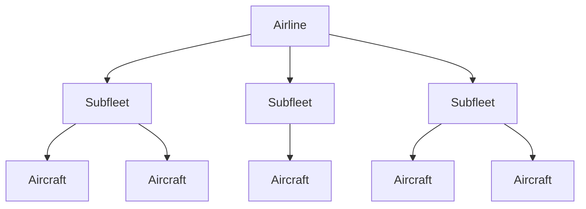
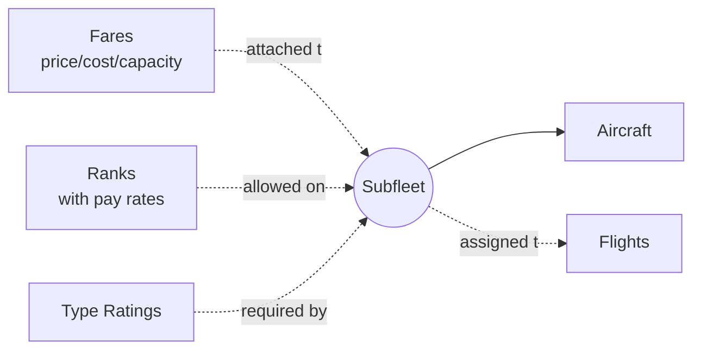
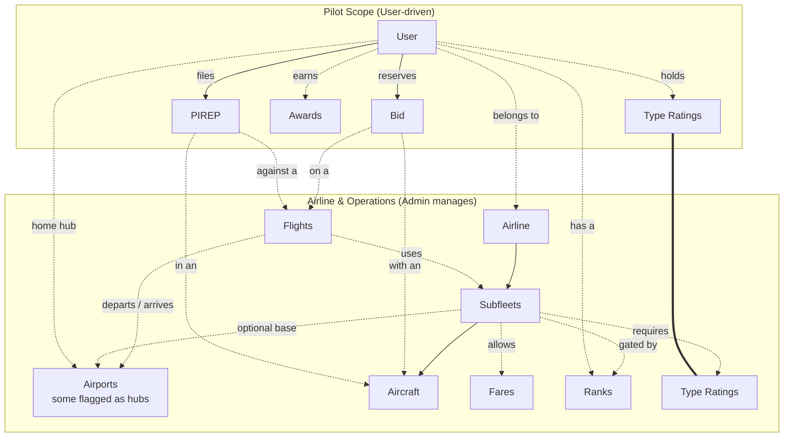
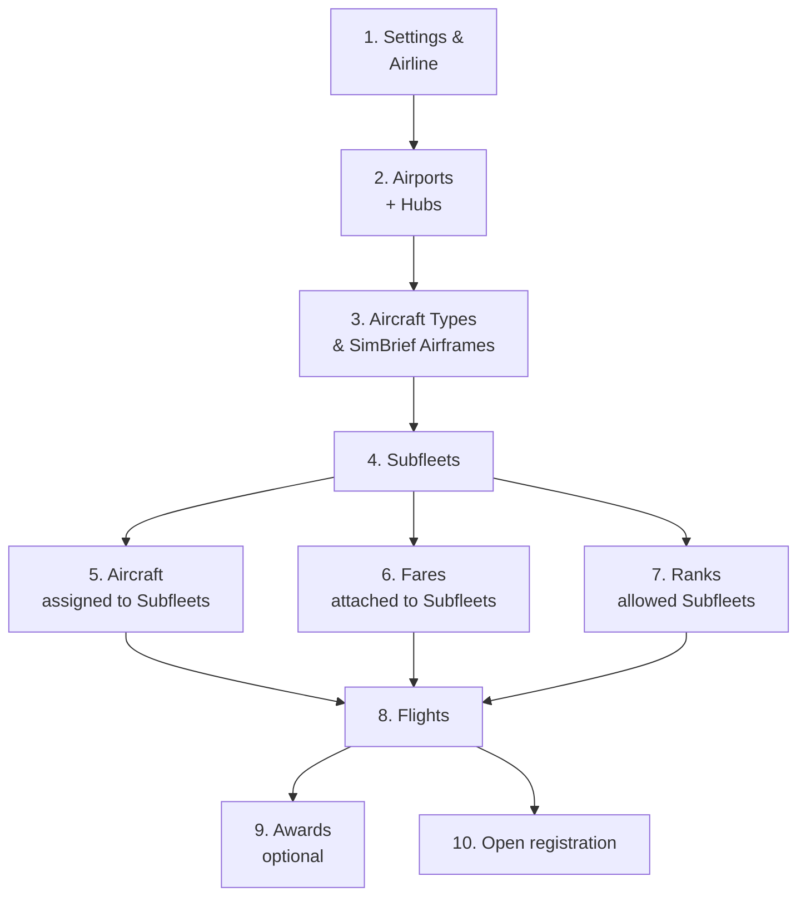

# How phpvms Works

phpvms is built around a set of entities that work together to model how a real
airline operates. This page explains how those pieces fit together — and the
order to set them up — before you dive into the admin panel.

For per-entity field reference, see the [Deeper Dive](./deeper-dive.md). For
tricky terminology, see the [Glossary](./glossary.md).

## Airlines

An airline owns multiple subfleets; each subfleet contains aircraft. Aircraft
never live outside a subfleet.

## Subfleets

A subfleet is a key unit: it bundles **fares** (with overridable
price/cost/capacity), gates access by **rank**, optionally requires **type
ratings**, and is what **flights** reference when scheduling.

## The Pilot's Loop

Two scopes: what an **admin** configures, and what a **pilot** drives. Dashed
arrows cross between them — that's where pilot activity references
admin-configured entities.

The `===` link shows pilot type-ratings and subfleet-required type-ratings are
the same entity, just rendered in both scopes for clarity.

The whole airline economy hangs off accepted PIREPs: a pilot bids on a flight +
aircraft, files a PIREP, an admin accepts it, and the system posts journal
entries (revenue, fuel, pay), credits hours, re-checks awards, and may
auto-promote rank. Until a PIREP is accepted, no money moves and no hours are
credited.

## Configuration Order

After installation, configure your airline in this order. Each step depends on
the previous one.

**Why this order:** Subfleets are a branching unit — Aircraft live inside them,
Fares attach to them, Ranks gate them, and Flights reference them. Get airlines,
airports, and the aircraft types you need first, then build subfleets, then
everything else slots in.

# Finances

Money in phpvms moves through journals. Pilots earn pay, airlines collect
revenue, and expenses post against either. None of this happens until a PIREP is
**accepted** — that's the trigger.

## Journals

Journals hold transactions. One journal per:

- Every airline
- Every user

The balance of a journal = sum of credits − sum of debits. Each transaction also
has a **group**, which financial reports use to roll up totals.

The journaling system means airlines and users can be paid or charged with
historical records preserved, and reports can run across any time window.

## Fares and Fare classes

Fares are the prices passengers pay for seats (or that cargo classes pay for
weight). When a PIREP is filed, phpvms looks up the fare price in this order:

1. **Per-flight fare** — `flight_fare` pivot, set when the fare is attached to a
   specific flight
2. **Per-subfleet fare** — `subfleet_fare` pivot, defaults that apply to any
   flight using that subfleet
3. **The base fare** — global fare record (the fallback)

When a fare is attached to a subfleet or flight, you can set the value as either
a fixed amount or a **percentage**. The `%` sign is required to trigger
percentage mode. `100%` means "use the base value". `200%` means "double it".

The percentage mode is powerful: define one global "Economy" fare at $100,
attach it to a holiday flight at `200%`, and that flight's economy seat
automatically prices at $200 — without creating a duplicate fare record.

### Subfleet fares

Subfleets need fares attached to them. These fares are shared across every
aircraft in the subfleet. You can override **cost, price, and capacity** per
subfleet — one subfleet might have more economy seats than another, but they
both reference the same global "Economy" fare.

### Flight fares

Adding a fare to a flight overrides the subfleet's value for that flight only.

The override can be a fixed amount or a multiplier. Default (no value set) =
`100%` of whatever the subfleet would charge.

This is useful for **aircraft substitutions**. A normal route might only have
Economy and First. But if a substitute aircraft offers Premium Economy too,
attach Premium Economy to the flight at `120%` — and any PIREP filed on that
flight will use that price.

## Expenses

Expenses are arbitrary debits against an airline or user. Three types:

| Type        | When it fires     | Notes                                    |
| ----------- | ----------------- | ---------------------------------------- |
| **Flight**  | Each flight flown | Can charge the airline or the user/pilot |
| **Daily**   | Once per day      | Requires cron                            |
| **Monthly** | Once per month    | Requires cron                            |

:::note

Daily and monthly expenses depend on the [cron job](../installation/cron.md)
being set up correctly.

:::

Beyond the global "Expenses" admin section, expenses can also attach to specific
objects so you can model fees as granularly as you want:

| Object       | Flight expense                                 | Daily expense          | Monthly expense  |
| ------------ | ---------------------------------------------- | ---------------------- | ---------------- |
| **Aircraft** | Rental, catering — chargeable to pilot         | Cleaning               | Lease, MRO costs |
| **Airport**  | Landing fees (arrival only) — pilot-chargeable | Daily airport fees     | Gate charges     |
| **Subfleet** | Per-flight fee, pilot-chargeable               | Daily subfleet charges | Monthly fees     |

### Custom expenses

For dynamic logic — charging a pilot for a hard landing, or a flight that
exceeded its planned time — write a `Listener` for the `Expenses` event. See
`app/Listeners/ExpenseListener` for the reference implementation. Custom
expenses can also fire on daily and monthly schedules.

## Further reading

- [ExpertFlyer's real-world fare class list](https://www.expertflyer.com/sessionlessClassList.do)
- [Forum: Connecting flights](https://forum.phpvms.net/topic/24329-connecting-flights/)
- [Quora: Multi-leg vs multi-segment](https://www.quora.com/What-is-the-difference-between-Multi-leg-and-Multi-segment-flights)
