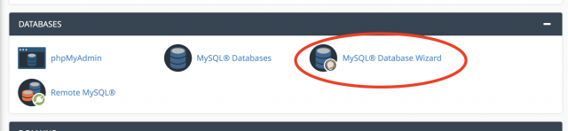
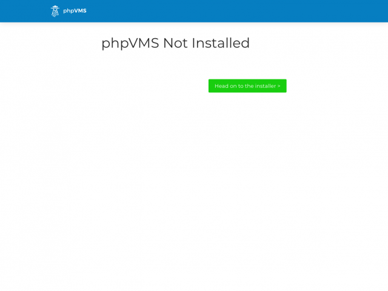
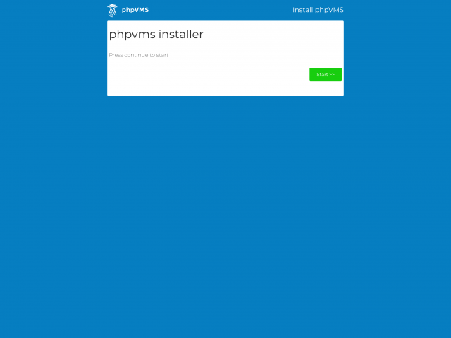
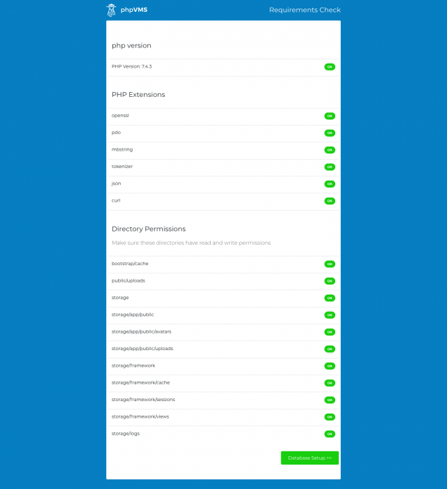
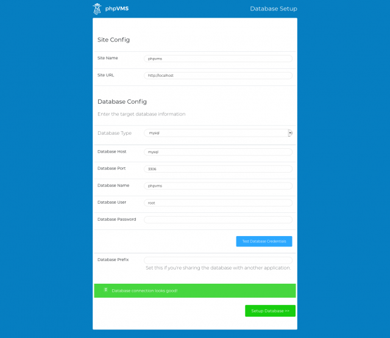
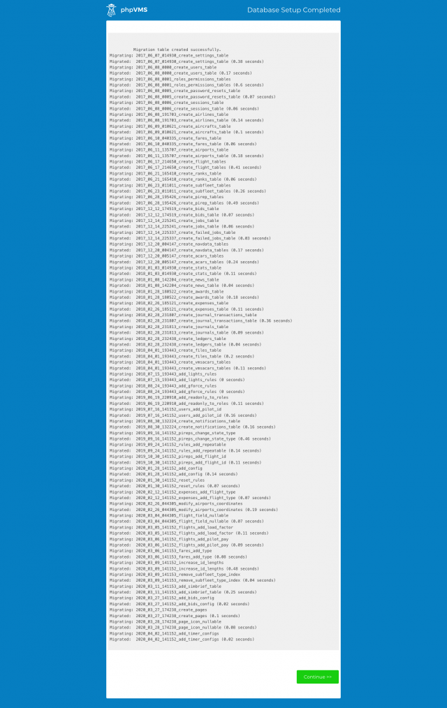
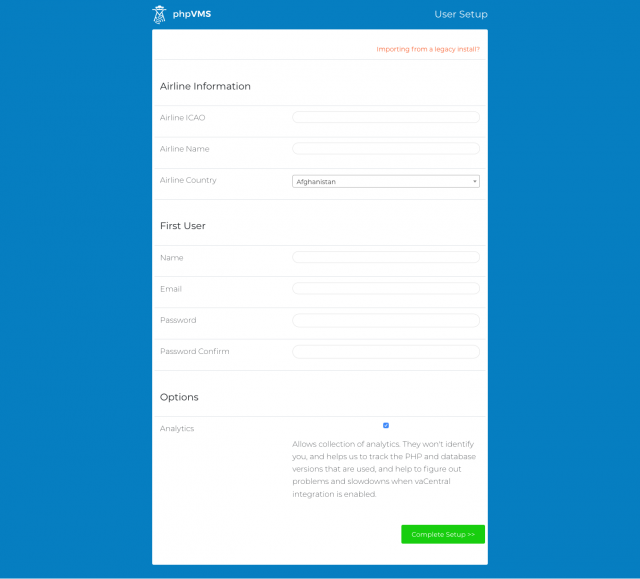
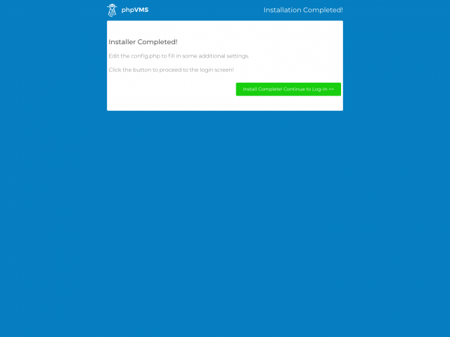

The installation requires a few steps:

1. File Permissions - some folders are written into and their permissions need
   to be configured properly
1. Database Setup - right now, only MySQL (or its offshoots, like MariaDB or
   Percona are supported). Create the credentials for the database using either
   the command line or the cPanel Database Wizard.
1. Composer Install - only if you have cloned it from git or downloaded the
   "raw" zip/tar and not a release or distributed version
1. Running the installer - This is a web interface, through which you can also
   import your older phpvms 2.x or 5.x install

## 1. Create the Database

Before running the install, you need to configure the database with the database
itself and the credentials. Refer to your hosts documentation for specifics -
the database name, username and password here are just examples, replace them
with your own. This example is for MySQL:

:::caution

Character Set and Collation If you're using a non-English language, make sure
that you're setting the `CHARACTER SET` and `COLLATE` properly (see below for
the utf8 values). By default it's `latin` which would result in corrupted
characters

:::

```sql
CREATE DATABASE IF NOT EXISTS `phpvms` CHARACTER SET UTF8 COLLATE utf8_unicode_ci;
CREATE USER 'phpvms'@'localhost' IDENTIFIED BY 'password';
GRANT ALL PRIVILEGES ON phpvms.* TO 'phpvms'@'localhost';
FLUSH PRIVILEGES;
```

### Using the cPanel Database Wizard

You can also use the cPanel Wizard to create the credentials prior to install



## 2. Go to the Installer

Once you go to your site, you'll see a page like this, click to proceed to the
installer.

 

After clicking next, you'll see the requirements check page. The installer will
only let you proceeed if all of the requirements are met.

### Requirements Check



This will make sure that all of the required extensions are installed and
enabled, and the file permissions are set correctly.

### Database Credentials

The next page brings you to the database setup page. Select `MySQL` (`sqlite`
requires some extra configuration)

- Enter the name of your site and the URL
- Enter your database credentials.
  - These are the credentials created above
  - Contact your host for the correct database server address. Usually it is
    `localhost` or `127.0.0.1` but it might be different
  - You can test to make sure they're working by clicking the "Test Database
    Credentials" button



After clicking "Setup Database", you'll see the installation screen. Hit next to
proceed:



### Initial Airline Setup

You'll be brought to the initial setup screen.Create your first airline here,
along with your user and password. This will be automatically made as an admin
user.



After setting that up, you'll see the completion screen, where you can click
next and proceed to login. You'll see your dashboard after logging in, and the
installation is complete!



## Next Steps

1. Read [about the configuration files (email, etc)](../config/files.md).
2. [Setup the cron task on your server](./cron.md)

## Troubleshooting

### Installer 404

If you're getting a 404 when trying to access the installer, this is either
because:

1. You haven't uploaded the files properly — [read Uploading Files](./download.md)
2. Your vhost isn't correct — [read VHost Configuration](./vhost.md)
3. Your host doesn't support `.htaccess` files — contact your host

### Permissions Errors

The installer will present a list of folders which need to have write access by
your webserver user. Contact your host if you're having problems with this.

These directories need to be writable:

- `bootstrap`
- `bootstrap/cache`
- `storage/logs`
- `storage/framework/cache`
- `storage/framework/session`
- `storage/framework/views`
