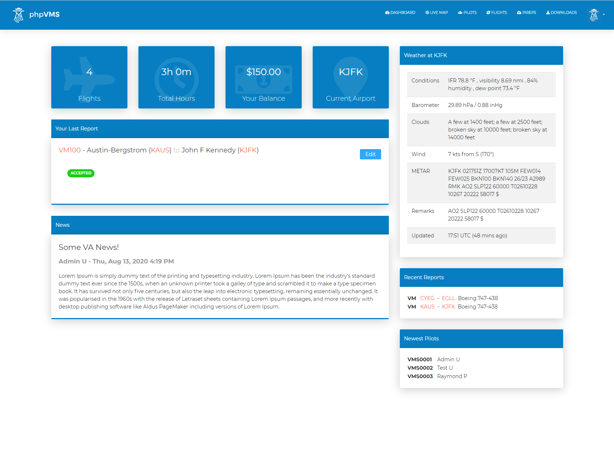

# phpvms - Virtual Airline Management

Welcome to the phpvms Docs site! phpvms is a PHP based application to run and
simulate and airline. It allowed users to register, view flight schedules that
you create, and file flight reports.

## Demo

The demo site is located at [https://demo.phpvms.net](https://demo.phpvms.net).
The login to the admin is `admin@phpvms.net` with a password of `admin`. The
demo is reset occasionally.

## Source

The source is hosted on github:
[https://github.com/nabeelio/phpvms](https://github.com/nabeelio/phpvms)

phpvms is open-source and licensed under the
[BSD 3-Clause License](https://github.com/nabeelio/phpvms/blob/dev/LICENSE).
