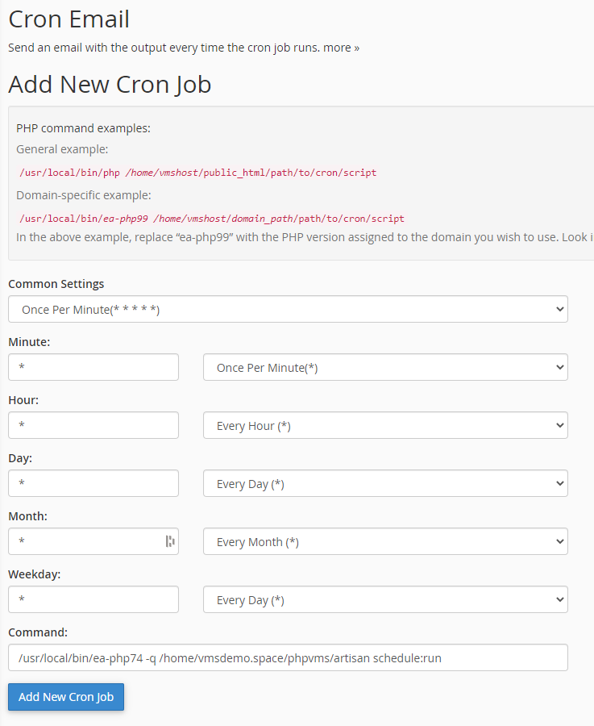
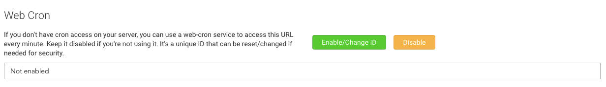

In order for some phpVMS features to work, a cronjob is required to be setup.
Some of the features that rely on cronjobs include:

- Job queue tasks (sending emails, notifications)
- Finances
- vaCentral features

:::note

If you can't run it once a minute, the lowest interval possible is fine, but
should be in 5 minute increments, since there are tasks that run at 5,15, and 30
minute intervals.

:::

## Info about "Shared Hosting"

Many hosts limit the usage of cron, either by limiting it directly or limiting
php extensions needed by cron. So if you are planning to use a "Shared Hosting",
better to focus on cron and email settings first (specially if they offer a
money back quarantee), if cron is failing and you can not get it working
properly consider finding a different service provider. Even some hosts limit
WebCron services, be advised, without a working cron you will not get the best
of phpVMS v7.

## Configuration on a Server

If you have SSH and `crontab` access, this is the easiest way to configure the
cron job. You need the path to the `bin/cron` file that's in the root of the
phpVMS install. After that, add a cronjob that runs once a minute. Do not forget
to include the username, for example, using `crontab -e`:

```bash
# THIS IS AN EXAMPLE
* * * * * php /path/to/phpvms/bin/cron >> /dev/null 2>&1
```

If your server has access to `proc_open`, you can also use the Laravel schedule
runner:

```bash
# THIS IS AN EXAMPLE
* * * * * php /path/to/phpvms/artisan schedule:run >> /dev/null 2>&1
```

---

## cPanel Configuration

phpVMS, in the admin panel, can suggest a cron path/command for you, under
`Admin -> Maintenance`. However, before trying that, try setting it up according
to your host's instructions.

:::tip

Note the "Domain Specific Example" Many hosts offer multiple PHP versions, make
sure to use the path to the PHP 7.x version in the cronjob. Contact your host!
Point them to this page. The example below uses PHP 7.4.

:::

With cPanel, select "Once Per Minute" under "Common Settings", and you can use a
similar command.

```bash
/usr/local/bin/ea-php74 -q /your/path/to/phpvms/bin/cron
```



---

## Web Cron

If you're unable to use the cron on your server, or want an easier setup, you
can use the web cron. To enable it, go to `Maintenance` in the admin panel. It's
disabled by default:



Clicking the enable button gives a URL that can be used in the web-cron service
to hit:


This URL can also be reset as the ID at the end if generated by random, for
security purposes.

---

## Guides on setting up a cron job

- [Adding a cronjob in cPanel](https://help.fasthosts.co.uk/app/answers/detail/a_id/2198/~/setting-up-cron-jobs-in-cpanel)
- [Adding a cronjob on Linux](https://www.cyberciti.biz/faq/how-do-i-add-jobs-to-cron-under-linux-or-unix-oses/)
